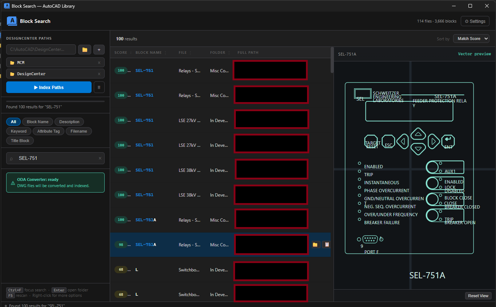

# Block Search - AutoCAD Library

<p align="center">
  
</p>

<p align="center">
  High-performance desktop search for AutoCAD block libraries (DWG/DXF) with fast indexing, fuzzy matching, and live preview.
</p>

<p align="center">
  
  
  
  
</p>

---

## Why Block Search

Block Search is built for engineering and CAD teams that manage large drawing libraries and need instant discovery of reusable blocks.

It combines:
- SQLite FTS5 full-text indexing for speed.
- RapidFuzz ranking for typo-tolerant search.
- ODA-assisted DWG parsing and conversion.
- A desktop-first UI with side-by-side result list and preview.

---

## UI Overview (Pic.png)



How the app works from left to right:

1. Library and indexing panel
- Add one or more DesignCenter folders.
- Start indexing with `Index Paths`.
- Track indexing health and ODA readiness status.

2. Search and filters
- Use instant search with category filters: `All`, `Block Name`, `Description`, `Keyword`, `Attribute Tag`, `Filename`, `Title Block`.
- Adjust ranking through fuzzy threshold and max results settings.

3. Results table
- Score-ranked matches with file, folder, and full path columns.
- Row actions for opening folder and copying paths.
- Keyboard support (`Ctrl+F`, `Enter`, arrow navigation, `F5`).

4. Preview viewport
- Right-side visual preview of selected block.
- Uses indexed preview images when available.
- Falls back to vector geometry rendering when needed.

---

## Feature Set

### Search and relevance
- Full-text search (SQLite FTS5).
- Fuzzy matching (RapidFuzz).
- Category-scoped querying.
- Result ranking by score and usage patterns.

### Indexing pipeline
- Batch scanning across multiple root folders.
- DWG and DWT indexing support.
- Progress reporting with status log.
- Incremental behavior optimized for large libraries.
- Force reindex option for clean rebuilds.

### Preview and visualization
- Preview generation during indexing and persisted cache (`data/previews`).
- Runtime display without requiring AutoCAD.
- Vector fallback for robust preview continuity.
- Pan/zoom viewport interactions.

### ODA integration
- Auto-detect ODA File Converter from known install locations.
- Manual path selection in settings.
- Optional guided setup script support (`setup_oda.py`).
- Graceful operation on DXF workflows if ODA is not installed.

### UX and operations
- Context menu actions (open file/folder, copy path/name, preview).
- Toast notifications and status bar feedback.
- Persistent app settings in `config.json`.
- Production build path via PyInstaller (`build.cmd`, `build.spec`).

---

## Quick Start

### 1) Clone and prepare environment

```powershell
git clone https://github.com/amnxlab/Block-Search-AutoCAD-Library.git
cd Block-Search-AutoCAD-Library
python -m venv .venv
.venv\Scripts\activate
pip install -r requirements.txt
```

### 2) Configure

```powershell
copy config.template.json config.json
```

Edit `config.json` minimally:

```json
{
  "scan_paths": ["R:/AutoDesk Vault/DesignCenter"],
  "oda_converter_path": "C:/Program Files/ODA/ODAFileConverter 27.1.0/ODAFileConverter.exe"
}
```

### 3) Run

```powershell
python main.py
```

---

## Build for Production (Windows EXE)

```powershell
build.cmd --clean
```

Optional portable archive:

```powershell
build.cmd --clean --zip
```

Expected output:
- `dist/BlockSearchTool.exe`

Notes:
- Build is configured as onefile in `build.spec`.
- Resources, setup script, and vendor folders are bundled according to spec rules.

---

## Settings Reference

| Key | Type | Default | Description |
|---|---|---|---|
| `scan_paths` | array | `[]` | Root folders to scan |
| `scan_extensions` | array | `[".dwg", ".dwt"]` | Extensions included in indexing |
| `oda_converter_path` | string | `""` | Full path to `ODAFileConverter.exe` |
| `db_path` | string | auto | SQLite index database location |
| `fuzzy_threshold` | number | `60` | Fuzzy score cutoff (`0..100`) |
| `max_results` | number | `200` | Max rows returned per query |
| `debounce_ms` | number | `300` | Search debounce latency |
| `skip_anonymous_blocks` | bool | `true` | Skip anonymous/system block records |
| `preview_export_on_index` | bool | `true` | Export previews during indexing |
| `preview_image_size` | number | `700` | Preview image size in pixels |
| `ui_text_scale` | number | `1.0` | Global UI text scale (`0.8..2.0`) |
| `theme` | string | `"dark"` | Current UI theme |

---

## Architecture Snapshot

```text
main.py
  -> load config + bootstrap Qt app
  -> create main window and web channel

resources/ui/index.html
  -> desktop SPA (controls, table, preview panel)
  -> communicates with Python via QWebChannel

gui/bridge.py
  -> exposes backend slots to JS
  -> orchestrates search, indexing, settings, OS actions

core/indexer.py + core/dwg_parser.py
  -> scan files and parse DWG/DXF blocks

core/database.py + core/search_engine.py
  -> FTS index + ranked search retrieval
```

---

## ODA File Converter

DWG workflows require ODA File Converter (free):
- Download: https://www.opendesign.com/guestfiles/oda_file_converter
- Configure path in Settings, or let the app auto-detect.
- If unavailable, DXF indexing and search still work.

---

## Troubleshooting

### No DWG results
- Confirm ODA is installed and path is valid.
- Verify target folders are included in `scan_paths`.
- Run `Index Paths` again after updating ODA settings.

### Preview missing for a row
- Reindex to regenerate preview assets.
- Check `data/previews` exists and is writable.

### Packaged app does not reflect config
- Ensure `config.json` next to EXE has expected values.
- Restart app after changing `ui_text_scale`.

---

## Roadmap Ideas

- Saved search profiles.
- Team-shared index service.
- Additional visual themes.
- Export selected result sets (CSV/JSON).

---

## License

MIT License.

---

## Acknowledgements

- Open Design Alliance (ODA File Converter)
- Qt / PySide6
- ezdxf
- RapidFuzz
- SQLite FTS5
